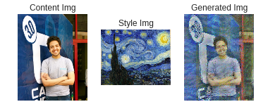

# Style_Transfer

An implementation of neural style in Pytorch from ["Image Style Transfer Using Convolutional Neural Networks" (Gatys et al., CVPR 2015)](http://www.cv-foundation.org/openaccess/content_cvpr_2016/papers/Gatys_Image_Style_Transfer_CVPR_2016_paper.pdf)..

# network 

- the ntwork used to extract the features from the image is [SqueezeNet](https://arxiv.org/abs/1602.07360) Beacause it's very small an efficient 

# Examples
As any great programmer, i used my photo :D

# Dependencies

* [Pytorch](https://pytorch.org/)
* [NumPy](https://github.com/numpy/numpy/blob/master/INSTALL.rst.txt)
* [SciPy](https://github.com/scipy/scipy/blob/master/INSTALL.rst.txt)
* [PIL](http://pillow.readthedocs.io/en/3.3.x/installation.html#installation)

# Resources
- [CS321n - Stanford University](http://cs231n.stanford.edu/2017/index.html) 
- ["Image Style Transfer Using Convolutional Neural Networks" (Gatys et al., CVPR 2015)](http://www.cv-foundation.org/openaccess/content_cvpr_2016/papers/Gatys_Image_Style_Transfer_CVPR_2016_paper.pdf)
